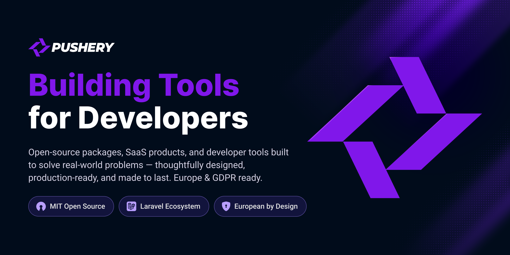

 <h1 align="center">PUSHERY</h1> 
 <strong>Apps, packages, and open-source tools for the Laravel ecosystem</strong>   We build practical software for real applications — with Laravel at the core 
 
 <a href="https://www.pushery.com/">🌐 Website</a> &nbsp;·&nbsp; <a href="https://docs.pushery.com/">📚 Documentation</a> &nbsp;·&nbsp; <a href="mailto:hello@pushery.com">✉️ Contact</a> 
   <h2 align="center">👋 About PUSHERY</h2> 
 <em>Built with Laravel.</em>   <em>Ready for now and beyond.</em> 

**PUSHERY** is a Berlin-based software and product studio building Laravel applications, SaaS products, developer tools, and open-source packages.
Laravel sits at the core of much of what we build. We care about software that solves real problems, has a clean and understandable API, is thoroughly tested, properly documented, and stays maintainable long after the first release.
A growing part of our work is released as **free and open-source software under the MIT license** — packages that solve problems we've encountered while building real applications ourselves.
👉 Explore everything at [**pushery.com**](https://www.pushery.com/)
📚 Documentation for our packages lives at [**docs.pushery.com**](https://docs.pushery.com/)
  <h2 align="center">⚡️ Featured: WireKit</h2> 
 <em>Free and open-source UI components for Laravel Livewire</em> 
 
 <a href="https://www.wirekit.app/"><picture><source media="(prefers-color-scheme: dark)" srcset="https://raw.githubusercontent.com/pushery/wirekit/main/resources/branding/wirekit-logo-dark.png"><source media="(prefers-color-scheme: light)" srcset="https://raw.githubusercontent.com/pushery/wirekit/main/resources/branding/wirekit-logo-light.png"></picture></a> 

[**WireKit**](https://www.wirekit.app/) is our free, open-source UI component library for the **TALL stack** — styled with **Tailwind CSS v4**, powered by **Alpine.js**, and wired straight into **Laravel Livewire**.
It covers the full surface of modern product and admin interfaces — forms, navigation, overlays, data display, tables, charts, command palettes, layouts, feedback, marketing components, and much more — all built around one consistent design-token system.
WireKit is **server-side by design**: plain Blade and Livewire, no SPA runtime, no proprietary component syntax, and no paid Pro tier. Fully MIT licensed and can be used in personal, open-source, agency, and commercial projects.
composer require pushery/wirekit
php artisan wirekit:install

 <a href="https://www.wirekit.app/"><strong>🌐 Website</strong></a> &nbsp;&nbsp;·&nbsp;&nbsp; <a href="https://github.com/pushery/wirekit"><strong>💻 GitHub</strong></a> &nbsp;&nbsp;·&nbsp;&nbsp; <a href="https://docs.wirekit.app/"><strong>📚 Documentation</strong></a> 
   <h2 align="center">🧰 Open Source</h2> 
 <strong>Free to use. MIT licensed. Built for real applications.</strong>   We build Laravel packages around problems we repeatedly encounter in production. 
 <table> <tr> <td width="50%" valign="top">  <h3>💳 Billing for Laravel</h3> 
Provider-neutral billing for Laravel: <strong>subscriptions, invoices, metered usage, dunning, tax, entitlements, and e-invoicing</strong>.
 
Stripe-first, while keeping your application code behind provider-neutral contracts.
 
 <a href="https://github.com/pushery/billing-for-laravel"><strong>💻 GitHub</strong></a> &nbsp;·&nbsp; <a href="https://docs.pushery.com/billing-for-laravel/"><strong>📚 Docs</strong></a> 
 </td> <td width="50%" valign="top">  <h3>🪝 Webhooks for Laravel</h3> 
An all-in-one toolkit to <strong>send signed outbound webhooks, receive and verify inbound webhooks, manage customer endpoints, and observe deliveries</strong>.
 
Enable only the layers your application actually needs.
 
 <a href="https://github.com/pushery/webhooks-for-laravel"><strong>💻 GitHub</strong></a> &nbsp;·&nbsp; <a href="https://docs.pushery.com/webhooks-for-laravel/"><strong>📚 Docs</strong></a> 
 </td> </tr> <tr> <td width="50%" valign="top">  <h3>⚖️ Legal Consent for Laravel</h3> 
Versioned legal consent and document acceptance for Laravel.
 
Store and prove the <strong>exact legal text, version, hash, and context</strong> a user accepted — instead of reducing consent to a timestamp and a checkbox.
 
 <a href="https://github.com/pushery/legal-consent-for-laravel"><strong>💻 GitHub</strong></a> &nbsp;·&nbsp; <a href="https://docs.pushery.com/legal-consent-for-laravel/"><strong>📚 Docs</strong></a> 
 </td> <td width="50%" valign="top">  <h3>✨ Email Magic Link for Laravel</h3> 
Passwordless authentication for Laravel using <strong>magic links and one-time codes</strong>.
 
Works standalone or alongside Laravel Fortify.
 
 <a href="https://github.com/pushery/email-magic-link-for-laravel"><strong>💻 GitHub</strong></a> &nbsp;·&nbsp; <a href="https://docs.pushery.com/email-magic-link-for-laravel/"><strong>📚 Docs</strong></a> 
 </td> </tr> <tr> <td width="50%" valign="top">  <h3>📊 Matomo Analytics for Laravel</h3> 
Privacy-first Matomo analytics for Laravel with <strong>client- and server-side tracking, batching, reporting, Web Vitals, bot detection, and environment-driven tracking gates</strong>.
 
Works with self-hosted Matomo and Matomo Cloud.
 
 <a href="https://github.com/pushery/matomo-analytics-for-laravel"><strong>💻 GitHub</strong></a> &nbsp;·&nbsp; <a href="https://docs.pushery.com/matomo-analytics-for-laravel/"><strong>📚 Docs</strong></a> 
 </td> <td width="50%" valign="top">  <h3>🔗 Polyslug for Laravel</h3> 
Polymorphic, multilingual routable identity for Eloquent.
 
Build pretty URLs that are <strong>safe to expose, safe to rename, and correct across languages</strong>, with canonical redirects and hreflang support built in.
 
 <a href="https://github.com/pushery/polyslug-for-laravel"><strong>💻 GitHub</strong></a> &nbsp;·&nbsp; <a href="https://docs.pushery.com/polyslug-for-laravel/"><strong>📚 Docs</strong></a> 
 </td> </tr> </table> 
 <strong>📚 Looking for everything in one place?</strong>   <a href="https://docs.pushery.com/"><strong>Browse all PUSHERY package documentation →</strong></a> 
   <h2 align="center">🚀 Products</h2> 
 <strong>Open source is only one part of what we build.</strong>   We also create focused products for developers, teams, and people working with large amounts of digital data. 
 <table> <tr> <td width="50%" valign="top"> <h3>🌍 Linguist</h3> 
<strong>Localization management for developers and teams who care about clean localization.</strong>
 
Manage translation keys across projects, compare languages, work with variables, collaborate with your team, maintain revision history, and integrate with DeepL — without turning localization into another source of chaos.
 
Perfect for Laravel, but not limited to it.
 
<a href="https://www.linguist.eu/"><strong>🌐 Visit linguist.eu →</strong></a>
 </td> <td width="50%" valign="top"> <h3>📡 Postbox</h3> 
<strong>Your radar for creators and trends.</strong>
 
Build watchlists, research creators, compare performance, discover interesting profiles, and monitor trends across large datasets of Instagram and YouTube creators.
 
Built to make creator research lean, structured, and fast.
 
<a href="https://app.postbox.so/"><strong>🌐 Open Postbox →</strong></a>
 </td> </tr> </table>   <h2 align="center">❤️ Open source, for real</h2> 
 Useful infrastructure should not automatically need a paywall.    Our open-source packages are built to be used in commercial applications, not just as demos or abandoned side projects.   We aim for strong test suites, predictable APIs, practical documentation, and software that developers can confidently build on.    If something is useful to you, a ⭐ on the repository is always appreciated.    <strong>Found a bug or have an idea? Open an issue or send a pull request — contributions are welcome!</strong> 
   <h2 align="center">👋 Talk to us</h2> 
 Building something interesting, found a problem, or just want to say hello? 
 
 <a href="https://www.pushery.com/"><strong>🌐 Website</strong></a> &nbsp;&nbsp;·&nbsp;&nbsp; <a href="https://docs.pushery.com/"><strong>📚 Documentation</strong></a> &nbsp;&nbsp;·&nbsp;&nbsp; <a href="mailto:hello@pushery.com"><strong>✉️ Contact</strong></a> 
